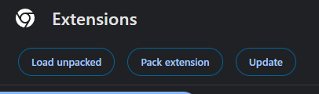
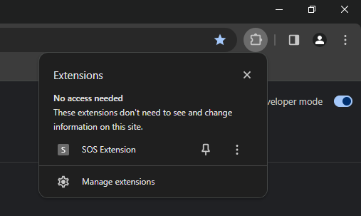
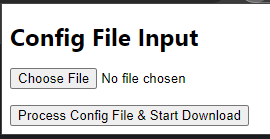
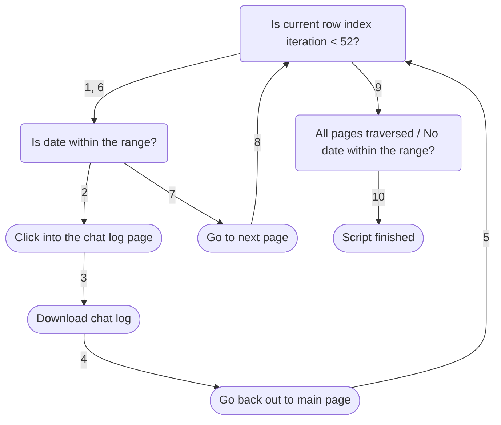
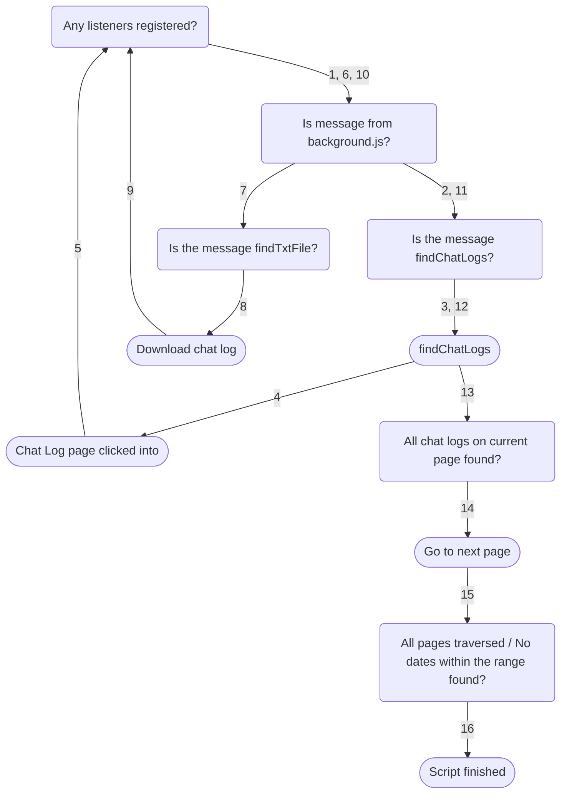
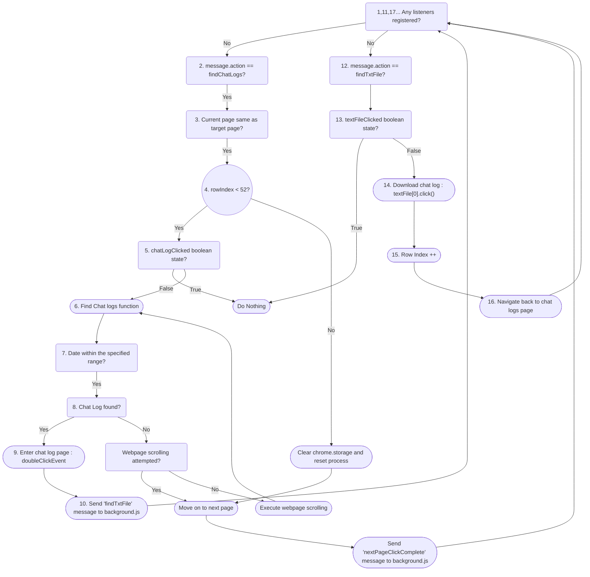

## Overview
This project is a Chrome Browser Extension developed as part of an Undergraduate Research Opportunity Project (UROP). The goal was to facilitate the download of transcript text files from a CRM Database using browser-based automation.

## Motivation
The CRM Database lacked a straightforward API for querying data, necessitating the creation of a solution that could automate the retrieval of transcript files directly through a browser extension.

## Technologies Used
- **Languages**: HTML, JavaScript
- **Tools**: Chrome Browser Extension APIs

## Key Features
- Enables users to initiate and automate the download of transcript text files.
- Integrates seamlessly into the Chrome browser environment.
- Provides a user-friendly interface for initiating the download process.

<br><br>

# <span style="color:#6495ED">Automated Transcript Downloader Browser Extension</span>

## <span style="color:#6495ED">Directory Structure </span>
```plaintext
├── UROP_Browser_Extension
│ ├── images
|
│ ├── helperFunctions
|   ├── date.js
│   ├── delay.js
│   ├── find.js
│   └── jquery-3.7.1.min.js
|
│ ├── Frontend
|   ├── form.html
│   ├── form.js
│   ├── popup.html
│   └── popup.js
|
│ ├── Backend
|   ├── background.js
│   ├── content.js
|
| ├── config.json
|
| ├── manifest.json
|
| └── README.md
```
**`images`**:
- Contains images used in the README.md file

**`helperFunctions`**:
- Contains functions used in the content.js file

**`Frontend`**:
- Contains the modules that initialise the extension and are shown to the user

**`Backend`**:
- Contains the 2 modules parse the user inputs and execute the actions done by the extension

**`config.json`**:
- Contains the configuration settings and data for the extension

**`manifest.json`**:
- Contains metadata and permissions for the extension

## <span style="color:#6495ED">Installation </span>
**This extension uses the Chrome Extension API and is only usable on the Chrome Browser** 
1. `Clone` the Repo via this [link][1]
2. `Open` the Chrome Browser and `enter` the [Chrome Extensions Page][2]
3. `Click` on **Load Unpacked** and `navigate` to the **"BrowserExtensionCRM"** folder <br><br>
 
<br><br>
4. An `icon` indicating the Extension has been loaded should appear <br><br>

<br><br>
5. `Click` on the **CRM Extension button** and this window should appear <br><br>

<br><br>
6. `Choose` the **config.json** file and `click` on **"Process Config File & Start Download"** to begin the automated process

- Might need to open Inspect Element (KIV)

## <span style="color:#6495ED"> Usage </span>
- config.json contains a piece of sensitive information. The naming conventions of the variables are as follows:
    - `"baseURL"` : [CRM Base URL]
    - `"txtFileAriaLabel"`: "a[aria-label='Messages_file.txt']"
    - `"nextPageAriaLabel"` : "[aria-label='Next page']"
    <br>=> Only the baseURL will need to be added in<br><br>
- The files will be downloaded under the **Downloads** folder of your local computer

## <span style="color:#6495ED"> Features </span>
- The extension features 7 files
    1. `manifest.json`: Defines metadata and permissions for the extension.

    2. `background.js`: Handles initialising of variable values, web navigation completion checks.

    3. `content.js`: Manipulates the web page's DOM to extract data.

    4. `jquery-3.7.1.min.js`: The jQuery library for simplifying DOM manipulation.

    5. `popup.html`: Defines the structure and content of the extension's popup.

    6. `popup.js`: Reads the config.json file and adds it to chrome.storage. It is the first js file that executes

    7. `config.json`: Stores configuration settings and data for the extension.


## <span style="color:#6495ED"> Contributing </span>

## <span style="color:#6495ED"> Non-Technical Logic Flow </span>


## <span style="color:#6495ED"> Simplified Logic Flow </span>


## <span style="color:#6495ED"> Technical Logic Flow </span>



[1]: https://github.com/Sean2309/UROP_Browser_Extension
[2]: chrome://extensions/

<!-- <span style="color:#ADFF2F"> -->